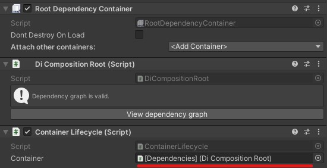
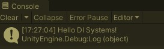

#  DI Systems

[](https://github.com/Delt06/di-systems/releases)
[](https://opensource.org/licenses/MIT)

An extension to [DI Framework](https://github.com/Delt06/di-framework) that allows defining a specific order of execution for gameplay systems.

> Developed and tested with Unity 2020.3.16f1

## Table of contents

- [Installation](#installation)
- [Usage](#usage)

## Installation

### Prerequisites

- Install [DI Framework](https://github.com/Delt06/di-framework)

### Option 1
- Open Package Manager through Window/Package Manager
- Click "+" and choose "Add package from git URL..."
- Insert the URL: https://github.com/Delt06/di-systems.git?path=Packages/com.deltation.di-systems

### Option 2  
Add the following line to `Packages/manifest.json`:
```
"com.deltation.di-systems": "https://github.com/Delt06/di-systems.git?path=Packages/com.deltation.di-systems",
```

## Usage

Create a system:
```csharp
using DELTation.DIFramework.Systems;
using UnityEngine;

public class HelloWorldSystem : IInitSystem
{
    public void Init()
    {
        Debug.Log("Hello DI Systems!");
    }
}
```

Create a system runner:
```csharp
using DELTation.DIFramework.Systems;

public class GameSystemsRunner : SystemsRunnerBase
{
    protected override void ConstructSystems()
    {
        Add<HelloWorldSystem>();
    }
}
```

Create/modify your custom dependency container:
```csharp
using DELTation.DIFramework;
using DELTation.DIFramework.Containers;

public class DiCompositionRoot : DependencyContainerBase
{
    protected override void ComposeDependencies(ICanRegisterContainerBuilder builder)
    {
        builder.Register<GameSystemsRunner>();
    }
}
```

Do not forget to attach a `ContainerLifecyle` for your custom container:


Run the game and check the console output:
